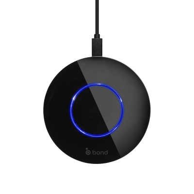
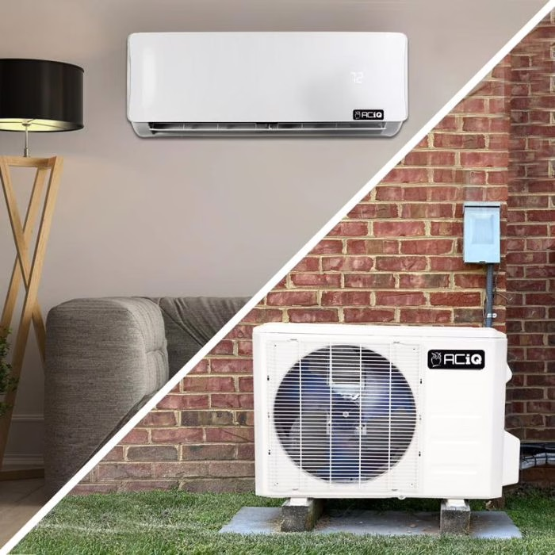
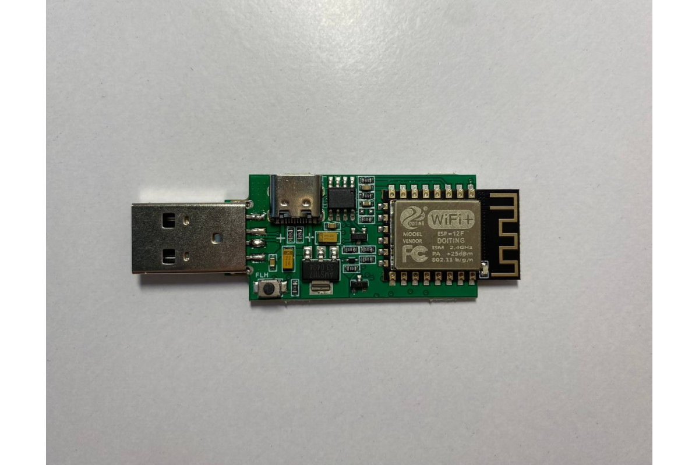
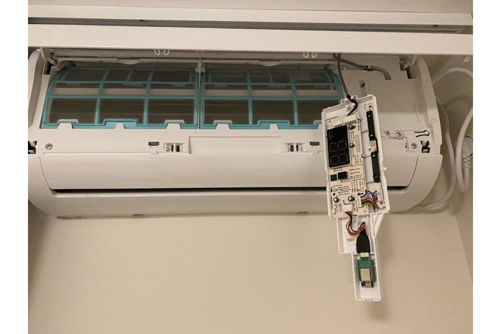

# Staying Cool - The 😎 Way
## Affordable Fan & AC Automation

---

# Today's Topics

- **Bond Bridge**: RF control for ceiling fans and other devices
- **ESPHome + Mini-Splits**: Climate control integration
- **Goal**: Enable smart control of existing devices

*Both solutions cost under $150 and integrate directly with Home Assistant*

---

# Bond Bridge Overview

## RF Control via WiFi/API
- **Purpose**: Control RF devices through Home Assistant
- **My Setup**: Ceiling fan with light combo
- **Process**: Device learns remote signals, replays them via API / App / HA

## Pricing & Availability
- **New**: $120 from Bond directly
- **Used**: ~$50 on eBay

---

# Bond Bridge - Important Limitation

## State Synchronization Issue
**Problem**: Physical remote usage doesn't update Bond Bridge state

## Recommended Solution
- Use Home Assistant exclusively for device control
- Store physical remotes away from daily use
- Keep wall power switches in ON position
- Maintain state consistency through single control point

---

# Bond Bridge Alternatives

## Other Open Source RF Options
- **Flipper Zero** (Multi-tool approach)
- **RTL-SDR dongles** (DIY implementation)  
- **SonOff RF Bridge** (Budget alternative)

## Bond Bridge Advantages
- Active community support
- Well-documented API
- Open-sourced CLI tools
- Responsive development team

---

# Mini-Split Climate Control

## Benefits of Mini-Split Systems
- **Efficiency**: Combined heating and cooling, more efficient than a window / indoor AC
- **Incentives**: [$2,000 Federal Tax Credit](https://www.energystar.gov/about/federal-tax-credits/air-source-heat-pumps) available for installation
- **Compatibility**: Most manufacturers use same "Midea" protocol

*Compatible brands include: ActronAir, Carrier, Electrolux, LG, Samsung, Toshiba, Mr.Cool, Senville and many others*

---

# ESPHome Integration

ESPHome is a system for controlling microcontrollers (like ESP32) through configuration files, with direct Home Assistant integration.

## Implementation Options
- **Pre-made solution**: $12 dongle from smartlight.me
- **DIY alternatives**: 
  - github.com/lizardsystems/midea-mini-dongle
  - github.com/dudanov/iot-uni-dongle

---

# Setup

## Available Controls
- Temperature and fan speed adjustment
- Mode selection (heat, cool, auto)
- Scheduling and automation
- Energy monitoring (model dependent)
[Official](https://esphome.io/components/climate/midea.html) / [Old Docs, What I Used](https://github.com/uncle-yura/esphome-midea-ac)

---

# Combined Solution Benefits

## Integration Results
**Bond Bridge** + **ESPHome Mini-Split** + **Home Assistant**

## Control Methods
- Mobile applications
- Voice assistants
- Home Assistant dashboards
- Automated routines

**Total investment**:
- Buy It: $60-$120~
- DIY It: $30-$40~ 

---

# Implementation Best Practices

## Lessons Learned
1. **Bond Bridge**: Commit to single control method for reliable state tracking
2. **Mini-Split**: Verify compatibility before purchasing dongles

## Useful Resources
- Bond CLI: github.com/bondhome/bond-cli
- HA Community: Mini-split compatibility discussions
- ESPHome documentation for configuration guidance

---

# That's All!
## Questions? Comments?